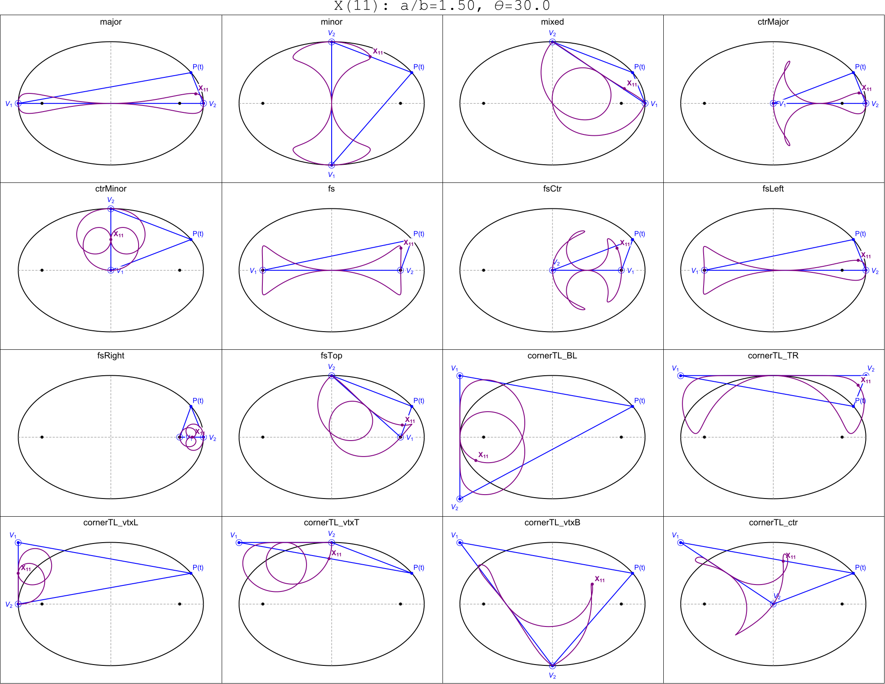

--- 
title: "9600 Loci of Ellipse-Mounted Triangles "
author: Dan Reznik and Iverton Darlan
date: July, 2020
output:
  bookdown::html_document2:
      includes: 
        before_body: header.html
      theme: darkly
      highlight: tango
      css: style.css
      toc_depth: 2
      toc: true
      toc_float:
        toc_collapsed: true
        smooth_scroll: yes
      fig_caption: yes
      number_sections: yes
link-citations: yes
bibliography: [references.bib]
csl: computer.csl
---

<!-- "default", "cerulean", "journal", "flatly", "darkly", "readable", "spacelab", "united", "cosmo", "lumen", "paper", "sandstone", "simplex", "yeti" -->

```{r,echo=F}
knitr::opts_chunk$set(
  cache=T,
  collapse=T,
  comment="#>",
  dpi=300,
  fig.align="center",
  out.width='100%',
  echo=F
)
```

```{r,message=F,cache=F,warning=F}
library(tidyverse)
library(fs)
library(slickR)
library(knitr)
source("util.R")
g_url <- "https://dan-reznik.github.io/ellipse-mounted-triangles"
```

# Intro

This exploration is inspired by Robert Ferréol's wonderful [Mathcurve](https://mathcurve.com/index.htm) portal. On that site an intriguing construction is given for the [Right Strophoid Curve]([https://mathcurve.com/courbes2d.gb/strophoiddroite/strophoiddroite.shtml) [@odehnal2015-conics] based on the locus of the Orthocenter $X_4$ of a triangle with two stationary vertices $V_1,V_2$ and a 3rd one $P(t)$ sliding along the circle centered at $V_1$ and of radius $r=|V_2-V_1|$:

```{r,out.width="30%"}
knitr::include_graphics("pics/single_vtx_strophoid.svg")
```

Here we study a related system: let $V_1,V_2$ still be two fixed vertices of a triangle, but with a third one $P(t)$ sliding along an *ellipse* $\mathcal{E}$ with semi-axes $a,b$. What are loci of Triangle Centers $X_k$ [@etc] for different "mountings" of $V_1,V_2$ on $\mathcal{E}$?

As an example, consider the locus (purple) of the Barycenter $X_2$ when $V_1,V_2$ are the right and top vertices of $\mathcal{E}$: 

```{r,out.width="50%"}
knitr::include_graphics("pics/single_vtx_example.svg")
```

Indeed, it can be shown that for whichever $V_1,V_2$, the locus of $X_2$ is, up to translation, a fixed ellipse $(a/3,b/3)$,

Consider the following 16 possibilities for the fixed vertices:

1. *major*: left and right ellipse vertices (EVs)
1. *minor*: top and bottom EVs
1. *mixed*: left and top EVs
1. *ctrMajor*: center and left EV
1. *ctrMinor*: center and top EV 
1. *fs*: the 2 foci
1. *fsCtr*: center and right focus ($F_2$)
1. *fsLeft*: left EV and $F_2$
1. *fsRight*: right EV and $F_2$
1. *fsTop*: top EV and $F_2$
1. *cornerTL_BL*: top left corner of ellipse bounding box (TL) and bottom left of the same (BL)
1. *cornerTL_TR*: TL and top right corner (TR) of ellipse bounding box
1. *cornerTL_vtxL*: TL and left EV
1. *cornerTL_vtxT*: TL and top EV
1. *cornerTL_vtxB*: TL and bottom EV
1. *cornerTL_ctr*: TL and center of ellipse

Under the above choices, the locus of $X_{11}$ (purple) sweeps out intriguing curves:

```{r,out.width="90%",background="white"}

```

# Loci Carousels {.tabset .tabset-fade .tabset-pills}

A total of `r 3*200*16` plots can be browsed below corresponding to:

+ 3 different ellipse aspect ratios $a/b\in\{1.5,2,3\}$, where $a,b$ are the semi-axes.
+ 200 Kimberling Centers $X_k,k=1,\ldots,200$
+ 16 choices for the fixed vertices (as above)

```{r,eval=F,include=F}
dir_ls("loci16_150") %>% as.character %>% length
```

## Aspect Ratio: a/b=1.5 {-}

```{r}
g_fnames <- as.character(dir_ls("loci16_150")) %>% str_c(g_url,"/",.)

#change dot's by numbers
cP1 <- htmlwidgets::JS("function(slick,index) {
                            return '<a>'+(1+10*index)+'</a>';
                            
                       }")
#Navigator menu
navigator_slicker <- function(){
  slickR(
    obj = (1:((g_fnames %>% length)-1)) %>% as.character,
    height=20,
    width="95%",
    slideId = "navigator",
    slideType = 'p') + 
    slickR::settings(
      lazyLoad = 'ondemand',
      speed=20,
      dots = T,
      #adaptiveHeight = T,
      slidesToScroll = 10
      ,slidesToShow = 10
      ,focusOnSelect = T
      ,customPaging = cP1
      ,asNavFor = ".slick-initialized"
    )
}
```

```{r}
navigator_slicker()

slickR(
    g_fnames[1:(length(g_fnames)-1)],
    slideId = "slider_loci16",
    height=600,
    #width = 800,
    width='95%',
    slideType = 'img-lazy') + 
  slickR::settings(
    fade=T,
    #adaptiveHeight=T,
    lazyLoad = 'ondemand',
    speed=20,
    asNavFor = ".slick-initialized") # + opts_dot_number
```

## Aspect Ratio: a/b=2.0 {-}

```{r}
navigator_slicker()

g_fnames <- as.character(dir_ls("loci16_200")) %>% str_c(g_url,"/",.)

slickR(
    g_fnames[1:(length(g_fnames)-1)],
    slideId = "slider_loci16",
    height=500,
    #width = 800,
    width='95%',
    slideType = 'img-lazy') + 
  slickR::settings(
    fade=T,
    #adaptiveHeight=T,
    lazyLoad = 'ondemand',
    speed=20,
    asNavFor = ".slick-initialized")
```

## Aspect Ratio: a/b=3.0 {-}

```{r}
g_fnames <- as.character(dir_ls("loci16_300")) %>% str_c(g_url,"/",.)

navigator_slicker()

slickR(
    g_fnames[1:(length(g_fnames)-1)],
    slideId = "slider_loci16",
    height=400,
    #width = 800,
    width='95%',
    slideType = 'img-lazy') + 
  slickR::settings(
    fade=T,
    #adaptiveHeight=T,
    lazyLoad = 'ondemand',
    speed=20,
    asNavFor = ".slick-initialized")
```

# Conclusion

The following web-based wolfram apps demonstrating the above are available:

- [1 mounting at a time](https://www.wolframcloud.com/objects/user-abf31092-d7c1-4e49-8701-dc65d547b021/locus%20vertex%20ellipse%20single%20v1).
- [16 simultaneous mountings](https://www.wolframcloud.com/objects/user-abf31092-d7c1-4e49-8701-dc65d547b021/locus%20vertex%20ellipse%20v1)
- Under construction: [p5.js interactive app](https://dan-reznik.github.io/ellipse-mounted-loci-p5js/)

Any comments, ideas, corrections, suggestions, and proofs contributed are very welcome. Email me at: `dreznik _theat_ gmail _thedot_ com`.

***

`r if (is_html_output()) '# References'`
