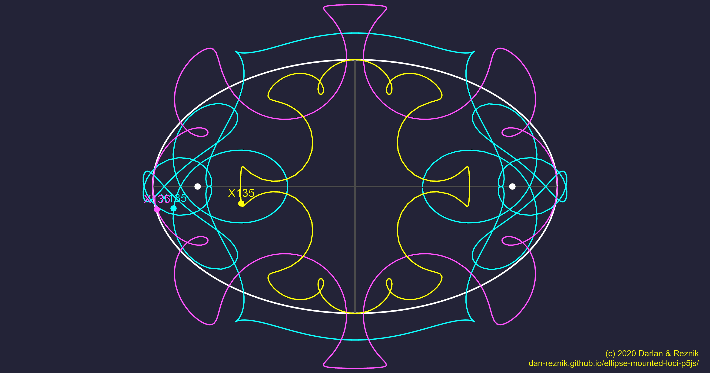
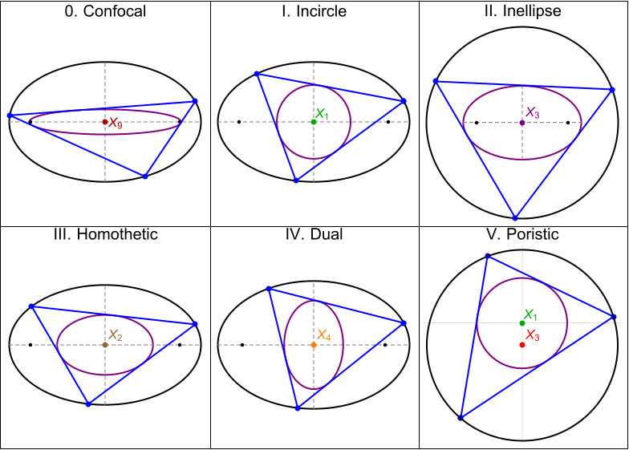

--- 
title: "Loci of Ellipse-Mounted Triangle Centers"
author: Dan Reznik and Iverton Darlan
date: July-December, 2020
output:
  bookdown::html_document2:
      includes: 
        before_body: header.html
      theme: darkly
      highlight: tango
      css: style.css
      toc_depth: 2
      toc: true
      toc_float:
        toc_collapsed: true
        smooth_scroll: yes
      fig_caption: yes
      number_sections: yes
link-citations: yes
bibliography: [references.bib]
csl: computer.csl
---

<!-- "default", "cerulean", "journal", "flatly", "darkly", "readable", "spacelab", "united", "cosmo", "lumen", "paper", "sandstone", "simplex", "yeti" -->

```{r,echo=F}
knitr::opts_chunk$set(
  cache=T,
  collapse=T,
  comment="#>",
  dpi=300,
  fig.align="center",
  out.width='100%',
  echo=F
)
```

```{r,message=F,cache=F,warning=F}
library(tidyverse)
library(fs)
library(slickR)
library(knitr)
source("util.R")
g_url <- "https://dan-reznik.github.io/ellipse-mounted-triangles"
```

# `r colorize("(new!)","red")` Tutorials {-} 

1. Web app: [here](https://dan-reznik.github.io/ellipse-mounted-loci-p5js/)
1. YouTube tutorial [playlist](https://www.youtube.com/playlist?list=PLTgIq68k2wHGBpTQgE3OmWMnK7BWTqfbU).
1. Slides of Arsty loci: (https://docs.google.com/presentation/d/1pHPrM3wdiabtE1_gzp5ZUAzMZku1GB0-u0TNQBxEGhM/edit?usp=sharing)
<!-- [long](https://docs.google.com/presentation/d/1jAiNvLYjUxUNXQ_Pa_7poxFtGvMcTajVkReupUyUpt8/edit?usp=sharing) -->
1. GitHub code [repository](https://github.com/dan-reznik/ellipse-mounted-loci-p5js)

# Introduction

The four classic triangle centers are (i) the incenter $X_1$ (where bisectors meet), (ii) the barycenter $X_2$ (the average of the vertices), (iii) the circumcenter $X_3$ (center of the circumscribing circle), and (iv) the orthocenter $X_4$ (where altitudes meet) [@mw]. The $X_k$ notation follows Kimberling's monumental Encyclopedia of Triangle Centers [@etc], where thousands of triangle centers and their properties are catalogued.

One prolific question is: what is the *locus* of some triangle center over some 1d *family* of triangles? The simplest family is perhaps one where two vertices are fixed (say, on the $x$ axis) and a third one moves parallel to it. Shown below are the loci of $X_i$, $i=1,2,3,4,20$ over such a family (see also this [video](https://youtu.be/Y50RFjhvsAo)):

```{r,out.width="60%"}
knitr::include_graphics("pics/horiz P3.png")
```

One notices right away the loci of $X_1$, $X_2$, $X_4$, and $X_{20}$ meet on two specific points. Furthermore, the loci of $X_4$ and $X_{20}$ are parabolas! We leave these as an exercise.

Loci phenomena are a historical subject of study. Recent works include  [@dykstra2006-loci], [@odehnal2011-poristic], [@pamfilos2020-euler], [@sergei2016-com], but there are many many others.

Here we document some features of our evolving, interactive [locus visualization app](https://dan-reznik.github.io/ellipse-mounted-loci-p5js/). The figure below shows an example of three simultaneous, intricate loci. To see it live click [here](https://bit.ly/3h2wXZ1):

```{r,out.width="80%"}

```

We were motivated by an intriguing construction for the [Right Strophoid Curve]([https://mathcurve.com/courbes2d.gb/strophoiddroite/strophoiddroite.shtml) [@odehnal2015-conics], on Robert Ferréol's wonderful [Mathcurve](https://mathcurve.com/index.htm) portal: such a curve is the locus of the Orthocenter $X_4$ of a triangle with two stationary vertices $V_1,V_2$ and a 3rd one $P(t)$ which is slid along the circle centered on $V_1$ and of radius $r=|V_2-V_1|$:

```{r,out.width="30%"}

```

In our app we consider a generalization: let $V_1,V_2$ be stationary with respect to an *ellipse* $\mathcal{E}$ with axes $a$ and $b$. Let a third vertex $P(t)$ slide along the boundary of $\mathcal{E}$. We can now trace out the loci of triangle centers such as the Incenter $X_1$, Barycenter $X_2$, Circumcenter $X_3$, etc., for different *mountings* of $V_1,V_2$ on $\mathcal{E}$. The $X_k$ notation follows Clark Kimberling's Encyclopedia of Triangle Centers [@etc].

As an example, consider the locus (purple) of the Barycenter $X_2$ when $V_1,V_2$ are the right and top vertices of $\mathcal{E}$: 

```{r,out.width="50%"}
knitr::include_graphics("pics/single_vtx_example.svg")
```

Amazingly, for $V_1,V_2$ fixed anywhere (not necessarily on the boundary of $\mathcal{E}$), the locus of $X_2$ is, up to translation, an ellipse with axes $a/3$ and $b/3$ [@akopyan2007].

Courtesy of Peter Moses, the app can draw loci for the first 1000 Kimberling centers.

# Triangle families

The app can calculate and display loci of triangle centers, vertices, and envelopes (see below) over two basic types of triangle families: Poncelet and Mounted.

## Poncelet Families

A Poncelet family of triangles is inscribed in a first conic and circumscribed about a second one. Currently we assume these are both ellipses with the 2nd one contained within the 1st. The Poncelet pairs currently available include:

1. *billard*: the inner ellipse is confocal to the outer $(a,b)$;
1. *homothetic*: outer ellipse $(a,b)$ and inner ellipse has axes $(a/2,b/2)$
1. *incircle*: outer ellipse $(a,b)$ and inner circle with $r=(ab)/(a+b)$;
1. *inellipse*: an inner ellipse $(a,b)$ and outer circle with $R=a+b$;
1. *dual*: outer ellipse $(a,b)$ and inner ellipse $(a',b')$ where $b'=(a^2 b)/(a^2+b^2)$ and $a'={b'}(b/a)$.
1. *poristic*: the family discovered by William Chapple (1718-1781) in 1746 with fixed incircle (inradius $r$) and circumcircle (circumradius $R$), with $d=|{X_1}{X_3}|=\sqrt{R(R-2r)}$.
1. *brocard*: fixed circumcircle and inner Brocard inellipse [@mw], Brocard points are stationary and Brocard angle is invariant!

Except for the last, the above Poncelet families are illustrated below:

```{r,out.width="90%",background="white"}

```

## Mounted Families

The app also provides triangle families $V_1 V_2 P(t)$, where $V_1,V_2$ are ``mounted'' (i.e., lie at stationary positions) with respect to an ellipse, and $P(t)=[a\cos{t},b\sin{t}]$ sweeps the boundary. The following 16 fixed locations for $V_1$ and $V_2$ are currently supported:

1. *major*: left and right ellipse vertices (EVs)
1. *minor*: top and bottom EVs
1. *mixed*: left and top EVs
1. *ctrMajor*: center and left EV
1. *ctrMinor*: center and top EV 
1. *fs*: the 2 foci
1. *fs-o*: center and right focus ($F_2$)
1. *fs-l*: left EV and $F_2$
1. *fs-r*: right EV and $F_2$
1. *fs-t*: top EV and $F_2$
1. *tl-bl*: top left corner of ellipse bounding box (TL) and bottom left of the same (BL)
1. *tl-tr*: TL and top right corner (TR) of ellipse bounding box
1. *tl-l*: TL and left EV
1. *tl-t*: TL and top EV
1. *tl-b*: TL and bottom EV
1. *tl-o*: TL and center of ellipse

As an example, below are loci of $X_{11}$ (purple) for each of the above:

```{r,out.width="90%",background="white"}
knitr::include_graphics("pics/single_vtx_intro.svg")
```

# Types of Loci

Loci over the selected triangle family $T$ can be calculated for the following objects:

1. $X_n$: a triangle center of $T$ from $X_1--X_{1000}$
1. $v_1$, $v_2$, $v_3$: one of the vertices of $T$.
1. $env$: the envelope of segment $X_n X_m$, $m{\neq}n$.
1. $e_{12}$, $e_{23}$, $e_{31}$: the envelope of a given side of $T$.
1. The following Bicentric Pairs [@etc-bicentric]:
    + $\Omega_1,\Omega_2$: the Brocard points
    + $\beta_1,\beta_2$: the Beltrami points: inversions of Brocards wrt circumcircle
    + $\mu_1,\mu_2$: the hitherto-named ``Moses'' points: inversion of Brocards wrt incircle
    + $\sigma_1,\sigma_2$: the two foci of the Steiner circumellipse (aka. the Bickart points)

# Derived Triangles

To increase the drawing powers of our app, loci can be computed with respect to centers of either the reference or four-dozen **derived** triangles, listed below (see [@mw] for their definition):

<div class = "row">
<div class = "col-md-3">
1. Reference
1. Anticomplementary
1. BCI
1. 1st Brocard
1. 2nd Brocard
1. 3rd Brocard
1. 4th Brocard
1. 5th Brocard
1. 6th Brocard
1. 7th Brocard [our invention!]
1. Circum-Medial
1. Circum-Mid-arc
1. Circum-Orthic
1. Excentral
1. Extouch
</div>
<div class = "col-md-3">
16. Extangents
1. Feuerbach
1. Fuhrmann
1. Half-Altitude
1. Hexyl
1. Incentral
1. Inner Vecten
1. Intangents
1. Intouch
1. Johnson
1. Lemoine
1. Lucas Central
1. Lucas Inner
1. Lucas Tangents
1. MacBeath
1. Medial
</div>
<div class = "col-md-3">
32. Mixtilinear
1. 1st Morley Adj
1. 2nd Morley Adj
1. 3rd Morley Adj
1. 1st Neuberg
1. 2nd Neuberg
1. Orthic
1. Outer Vecten
1. Reflection
1. Steiner
1. Symmedial
1. Tangential
1. Tangential Mid-Arc
1. Yff Central
1. Yff Contact
</div>
</div>

# Cevian-Type Triangles

One can also compute second-level cevian-like triangles with respect to a point $X_m$ of the reference or one of the above derived triangles. The available options are:

1. Cevian
1. Anticevian
1. Circumcevian
1. Pedal
1. Antipedal
1. Tripolar

# Associated circles

One is also able to superimpose a named circle (see list below) associated  with a triangle in the family under consideration. Furthermore one can also *invert* any triangle center with respect to the selected circle.

1. Circumcircle
1. Incircle
1. Brocard circle
1. etc.

# Loci Carousels {.tabset .tabset-fade .tabset-pills}

A total of `r 3*200*16` plots can be browsed below corresponding to:

+ 3 different ellipse aspect ratios $a/b\in\{1.5,2,3\}$, where $a,b$ are the semi-axes.
+ 200 Kimberling Centers $X_k,k=1,\ldots,200$
+ 16 choices for the fixed vertices (as above)

```{r,eval=F,include=F}
dir_ls("loci16_150") %>% as.character %>% length
```

## Aspect Ratio: a/b=1.5 {-}

```{r}
g_fnames <- as.character(dir_ls("loci16_150")) %>% str_c(g_url,"/",.)

#change dot's by numbers
cP1 <- htmlwidgets::JS("function(slick,index) {
                            return '<a>'+(1+10*index)+'</a>';
                            
                       }")
#Navigator menu
navigator_slicker <- function(){
  slickR(
    obj = (1:((g_fnames %>% length)-1)) %>% as.character,
    height=20,
    width="95%",
    slideId = "navigator",
    slideType = 'p') + 
    slickR::settings(
      lazyLoad = 'ondemand',
      speed=20,
      dots = T,
      #adaptiveHeight = T,
      slidesToScroll = 10
      ,slidesToShow = 10
      ,focusOnSelect = T
      ,customPaging = cP1
      ,asNavFor = ".slick-initialized"
    )
}
```

```{r}
navigator_slicker()

slickR(
    g_fnames[1:(length(g_fnames)-1)],
    slideId = "slider_loci16",
    height=600,
    #width = 800,
    width='95%',
    slideType = 'img-lazy') + 
  slickR::settings(
    fade=T,
    #adaptiveHeight=T,
    lazyLoad = 'ondemand',
    speed=20,
    asNavFor = ".slick-initialized") # + opts_dot_number
```

## Aspect Ratio: a/b=2.0 {-}

```{r}
navigator_slicker()

g_fnames <- as.character(dir_ls("loci16_200")) %>% str_c(g_url,"/",.)

slickR(
    g_fnames[1:(length(g_fnames)-1)],
    slideId = "slider_loci16",
    height=500,
    #width = 800,
    width='95%',
    slideType = 'img-lazy') + 
  slickR::settings(
    fade=T,
    #adaptiveHeight=T,
    lazyLoad = 'ondemand',
    speed=20,
    asNavFor = ".slick-initialized")
```

## Aspect Ratio: a/b=3.0 {-}

```{r}
g_fnames <- as.character(dir_ls("loci16_300")) %>% str_c(g_url,"/",.)

navigator_slicker()

slickR(
    g_fnames[1:(length(g_fnames)-1)],
    slideId = "slider_loci16",
    height=400,
    #width = 800,
    width='95%',
    slideType = 'img-lazy') + 
  slickR::settings(
    fade=T,
    #adaptiveHeight=T,
    lazyLoad = 'ondemand',
    speed=20,
    asNavFor = ".slick-initialized")
```

# Demo: Hexyl Loci

Shown below are a few sample triangle center loci of the Hexyl triangle over different mountings.

```{r}
g_fnames <- as.character(dir_ls("pics_dark")) %>% str_c(g_url,"/",.)

slickR(
    g_fnames[1:(length(g_fnames)-1)],
    slideId = "slider_hexyl",
    height=400,
    #width = 800,
    width='95%',
    slideType = 'img-lazy') + 
  slickR::settings(
    fade=T,
    #adaptiveHeight=T,
    lazyLoad = 'ondemand',
    speed=20
    #,asNavFor = ".slick-initialized"
    )
```

# Acknowledgements

This work would be impossible without the generous help and/or publications of Arsenyi Akopyan, Mark Helman, Robert Ferréol, Ronaldo Garcia, Clark Kimberling, Jair Koiller, Peter Moses, Hellmuth Stachel, Sergei Tabachnikov, and Eric Weisstein.

# Contact

Any comments, ideas, corrections, suggestions, and proofs contributed are very welcome. Email me at: `dreznik _theat_ gmail _thedot_ com`.

***

`r if (is_html_output()) '# References'`
